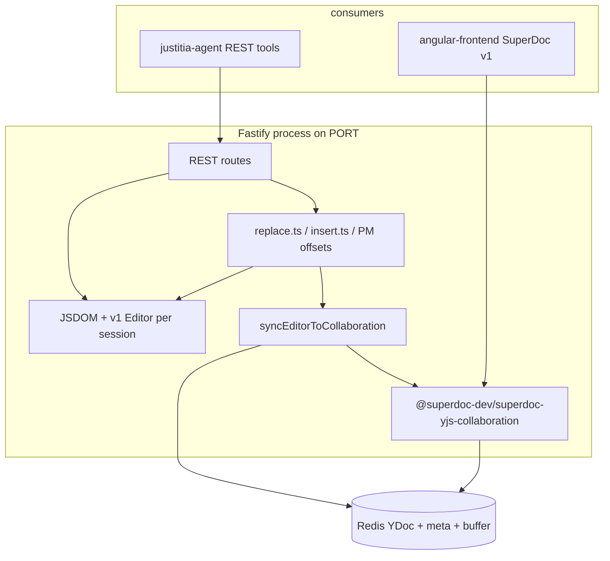
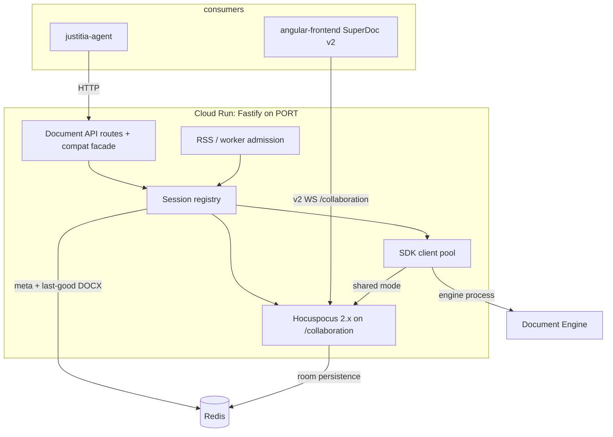
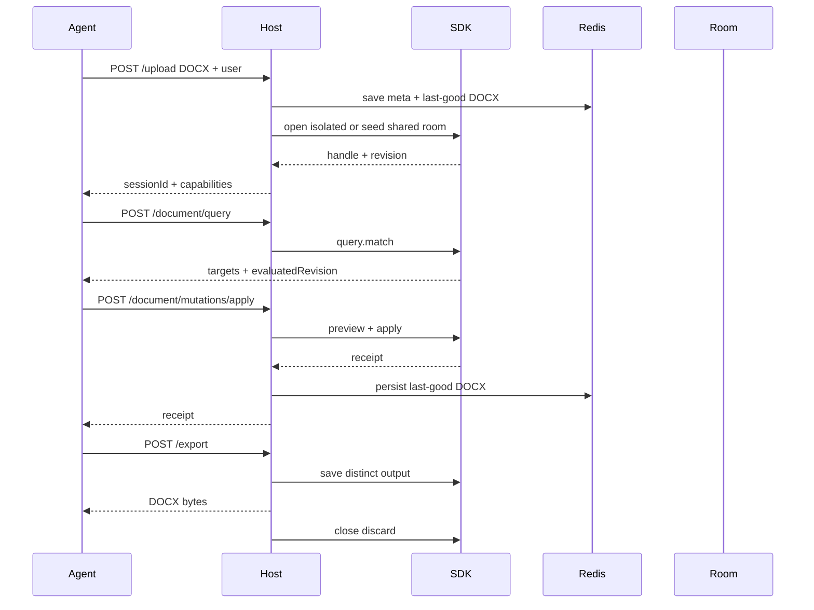
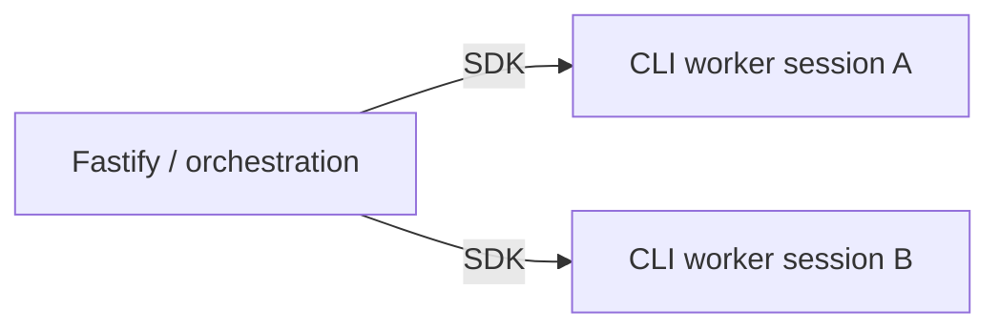
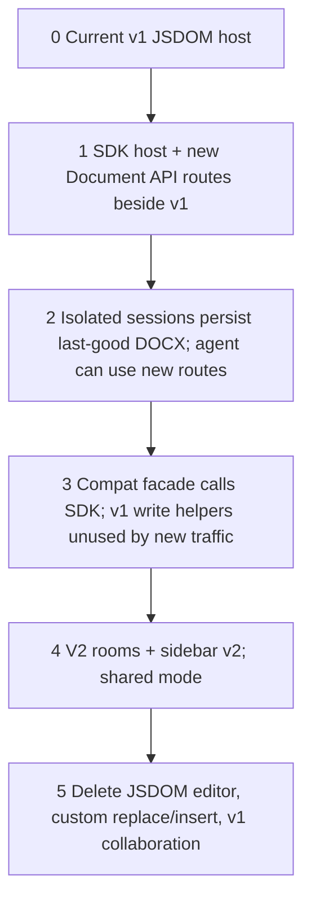

# SuperDoc Document Editor — Architecture Redesign

Companion to `ARCHITECTURE-SPINE.md`. This is the discussion document: current system, SuperDoc's 2026 Document API, the target host, and the cutover. The spine is the consistency contract. This file is the explanation.

**Status:** architecture only. No implementation in this change.
**Date:** 2026-09-03
**Altitude:** the whole editor service plus its two known consumers.

---

## 1. Why this exists

This repo is a headless SuperDoc host. An external agent (`justitia-agent`) uploads a DOCX, searches and edits it over HTTP, then exports. The Angular sidebar can also attach to the same session over a collaboration websocket.

That host was built against SuperDoc v1: a JSDOM-backed `Editor`, homemade ProseMirror transactions, homemade tracked-change marks, and a custom Yjs bridge so REST edits could appear in the browser.

SuperDoc now publishes a different integration:

- one **Document API** (query → target → mutate → receipt) for browser and headless
- official Node SDK (`@superdoc/sdk`) that manages an engine process instead of the v1 `Editor`
- atomic **mutation plans**
- stable-enough **block addresses** (`paraId` / `NodeAddress`)
- SDK clients that can **join the same v2 collaboration room** as the browser
- an explicit safety model (tracked mode, separate output, receipts, attributed authors)

The old internal specs (`document_editor_redesign.md`, the three LLD phases, `document-editor-redesign-spec.md`) named the same three problems this codebase still has. Those files were not in this workspace; their intent is reconstructed in §3 from the filenames and from the code. The target in §5 is not a revival of that older design. It is a new host built on the current SuperDoc contract.

---

## 2. What we run today



Facts that matter for the redesign:

| Area | Current behavior | Why it hurts |
| --- | --- | --- |
| Editing | `replaceTextWithFormatting` and friends fabricate `trackInsert` / `trackDelete` marks from ProseMirror `from` / `to` | Fragile across runs, lists, tables, track-over-track, newlines, NBSP |
| Addressing | Integer PM offsets are the agent contract; `paraId` was bolted on later | Offsets move after every edit; agents retry the wrong range |
| Runtime | One JSDOM window + SuperDoc editor per live session inside Fastify | RSS spikes on upload, rehydrate, replace-all, export; memory guard is a circuit breaker, not a design |
| Consistency | REST writes PM, then a host-owned snapshot/update is applied to a YDoc | Two documents, two update strategies, races with live browsers |
| Collaboration | v1 SuperDocCollaboration; websocket accept requires an in-memory session | Redis-only sessions cannot join; v2 editors cannot use these rooms |
| Export | `editor.exportDocx`, then drop in-memory maps and leave Redis | An "exported" session can be rehydrated; README still describes a second port |
| SuperDoc | `@harbour-enterprises/superdoc` 1.46.x, JSDOM `isHeadless: true` | v1 internals. SuperDoc now tells integrators not to use those packages |

The agent loop is still: upload → search/get-content → replace/insert by position → export. `justitia-agent` treats **404 as session expiry** and retries only **429/503**. Paragraph endpoints already return **400** for content errors so they are not mistaken for expiry. That status contract stays.

---

## 3. What the older specs were pointing at

The five named documents were not available in this repository or in accessible org search during this run. From the titles, the current code, and the `.memories/` notes, the older program had three phases:

### Phase 1 — Structural editing

Stop treating the document as a flat string with integer offsets. Target paragraphs, list items, and other blocks. The later `/replace-in-paragraph` and `/insert-after-paragraph` endpoints are a partial version of this, still implemented by falling back into the offset engine.

SuperDoc now owns this layer: `query.match`, `NodeAddress`, `paraId`-derived `nodeId`, `extract()`, `create.paragraph({ at: { kind: 'after' } })`, structural insert/replace.

### Phase 2 — Runtime memory

JSDOM + a full editor per session does not fit an 8 GiB Cloud Run box once several large contracts are warm. Today's answer is an RSS guard and delayed export eviction. The older LLD wanted the editor out of the request process.

SuperDoc's Node SDK is a **CLI-backed** client (`@superdoc/sdk` 2.8.0). The engine is not a JSDOM `Editor` living in the Fastify heap. That is the memory boundary this redesign takes.

### Phase 3 — Consistency ripple

REST edits and live collaboration diverge. The current `syncEditorToCollaboration` path exists because the host is the second writer. The older LLD wanted one write path so a change in targeting or persistence would not need a matching hack in the Yjs bridge.

SuperDoc now lets the same SDK handle join a v2 room. The host no longer needs to translate PM → Yjs.

Those three phases remain the right *problems*. They are not the right *implementation plan*. The rest of this document replaces that plan.

---

## 4. What SuperDoc now gives us

Verified 2026-09-03 against [docs.superdoc.dev](https://docs.superdoc.dev/) and npm.

| Surface | Package | Role |
| --- | --- | --- |
| Document API | contract, not a package | query, target, mutate, receipt — same names in browser and headless |
| Node automation | `@superdoc/sdk` **2.8.0** | typed handle; pulls `@superdoc/sdk-<platform>` binaries (not npm `@superdoc/cli`) |
| CLI (sibling surface) | `@superdoc/cli` **0.31.0** | shell/CI only; do not install it into this host |
| Browser editor | `superdoc` **2.11.0** | v2 engine; `editor.doc` is the Document API |
| Agent toolkit | `@superdoc/sdk` `createAgentToolkit` | optional; we are **not** embedding it in this host |
| Collaboration | v2 rooms via Hocuspocus, y-websocket, or Liveblocks | SDK can join the same room as the browser |

Do **not** integrate `@superdoc/headless` or `@superdoc/document-api-v2-adapter`. SuperDoc documents those as implementation details.

### 4.1 The operation loop

```ts
const match = await doc.query.match({
  select: { type: 'text', pattern: 'termination' },
  require: 'exactlyOne',
});
const receipt = await doc.replace(
  { target: match.items[0].target, text: 'cancellation' },
  { changeMode: 'tracked', expectedRevision: match.evaluatedRevision },
);
if (!receipt.success) throw receipt.failure;
```

Rules SuperDoc already enforces and this host must not weaken:

- A target or ref is valid only for `evaluatedRevision`.
- `require: 'exactlyOne'` is the safe default when one clause must change.
- Pending tracked deletions are excluded from text queries unless asked for.
- `sdBlockId` is session-scoped. Cross-open identity is `query.match` / `paraId` `NodeAddress`.
- Success is `receipt.success`, not "the call did not throw".
- Stale-revision codes: re-query, retry **once**, keep `expectedRevision`.

### 4.2 Mutation plans

Several edits that are one logical change:

1. `query.match` each target (same revision).
2. `mutations.preview(plan)` — no writes.
3. `mutations.apply({ atomic: true, changeMode: 'tracked', expectedRevision, steps })`.

If compilation, targeting, or revision checks fail, no step is applied.

### 4.3 Reads that replace `get-content`

| Need | Operation |
| --- | --- |
| Structured blocks + comments + tracked changes | `doc.extract()` |
| Counts / outline | `doc.info()` |
| Review HTML / Markdown with source map | `doc.projectHtml` / `doc.projectMarkdown` |
| Mutation-grade search | `doc.query.match` |
| Discovery-only search | `doc.find` (not for writes) |

`projectHtml({ reviewMode: 'redline' | 'final' | 'original', includeSourceMap: true })` is the replacement for homemade HTML with `<ins>` / `<del>` and homemade position maps.

### 4.4 Shared rooms from the SDK

```ts
const doc = await client.open({
  doc: lastGoodDocxPath,
  collaboration: {
    providerType: 'hocuspocus',
    url: roomUrl,
    documentId: sessionId,
  },
});
```

If the room already has content, `doc` is ignored and the SDK joins. If the room is empty, the DOCX seeds it. On `@superdoc/sdk` 2.8.0, reopen of a populated room is `roomMode: 'join'`. Do not copy `onMissing: 'error'` from `@superdoc-dev/sdk` docs — that field is not on the 2.8.0 types. First seed happens only inside `promoteToShared`.

This is the consistency answer. The agent and the sidebar become two clients of one room, not two stores the host reconciles.

### 4.5 Safety we adopt as host policy

From SuperDoc's agent safety guide:

- consequential edits are `changeMode: 'tracked'`
- write a distinct output; do not overwrite the only copy
- close the handle on every path
- attribute a real user, not `CLI`
- do not log document text
- do not dispatch unadvertised toolkit names (`superdoc_execute_code`, `agent_*`) — irrelevant if this host does not embed the toolkit, and a reason not to

---

## 5. Target architecture

### 5.1 Picture



The host is no longer an editor. It is:

1. an HTTP adapter for Document API operations
2. a session and identity boundary
3. a Hocuspocus 2.x room adapter on `/collaboration` (same port)
4. a persistence adapter for last-good DOCX and room bytes
5. admission control and telemetry

### 5.2 Two access modes

| Mode | When | How the handle opens | Who else is connected |
| --- | --- | --- | --- |
| **Isolated** | Agent-only job, no live human | `client.open({ doc: lastGoodDocx })` | nobody |
| **Shared** | After `promoteToShared` | `client.open({ collaboration, roomMode: 'join' })` | SuperDoc v2 browser clients |

`documents` is the only writer of `accessMode`. Upload writes isolated unless the caller requested shared and `promoteToShared` succeeds. A request must not silently switch modes. Advertising `collaborationUrl` does not set shared.

Shared mode cannot ship before the sidebar is on SuperDoc v2. Until then, isolated mode is the production agent path. Existing v1 rooms remain the human-visible path for the current sidebar; the SDK never joins them. Do not create v2 rooms or return a v2 `collaborationUrl` in that window.

### 5.3 Session lifecycle



Warm handles are optional. TTL, memory pressure, deploy, and crash all recover from Redis last-good DOCX (isolated) or from the room (shared). There is no "rehydrate by stuffing a YDoc into a JSDOM editor."

### 5.4 Where state lives

| State | Isolated | Shared |
| --- | --- | --- |
| Live document | SDK engine process behind the handle | v2 Hocuspocus room |
| Durable snapshot | last-good DOCX in Redis | last-good DOCX (host snapshot) |
| Recover on restart | last-good only | room blob if present; else seed last-good |
| Identity / TTL / mode | session meta in Redis | same |
| Browser presence | none | room awareness |

Export always produces a **new** artifact. It does not become the only copy of the pre-export document.

### 5.5 Process and memory



- Fastify does not load JSDOM SuperDoc.
- Each open document is an SDK-managed engine process. 2.8.0 default is the embedded platform binary (`processMode: 'cli'`); `documentHostPath` is an alternate host, not a reason to npm-install `@superdoc/cli`.
- Admission rejects upload, heavy plans, export, and re-open when RSS or worker slots are exhausted (503 + `Retry-After`).
- Close is best-effort in `finally` so a failed edit cannot leak a worker.

This is the replacement for Phase 2. We still need a measured budget (open question): how many representative contracts fit in 8 GiB.

### 5.6 Collaboration without a host-owned bridge

Shared mode:

1. `documents.promoteToShared` creates the Hocuspocus 2.x room (`documentId` = `sessionId`) and seeds it from last-good if empty.
2. Sidebar joins `/collaboration` with SuperDoc v2 (`v2Collaboration`, `roomMode: 'join'`, keep `?room=` until env configs change).
3. Agent operations open an SDK handle with `roomMode: 'join'` on that same `documentId`.
4. Tracked changes and comments appear in the sidebar because they were applied by the engine in the room, not because we copied marks into a YDoc.

V1 rooms are a different format. Do not connect a v2 editor to them. The frontend rollout and the shared-mode cutover are one change.

Room create vs join stays explicit. SuperDoc v2 has no join-or-create.

### 5.7 Identity, comments, review

- Upload already accepts a user. That user is required and is passed into `SuperDocClient` / `open`.
- Comments use `doc.comments.create` / `list` / `patch` with a query target.
- Tracked changes use `doc.trackChanges.list` / `get` / `decide`.
- Agent tool surfaces should **exclude** accept/reject so a person remains the reviewer. HTTP review endpoints may exist for the sidebar or internal tools, but they are not the agent default.

---

## 6. HTTP surface

### 6.1 Canonical routes (new)

Names can move; the shapes must stay Document API-shaped.

| Route | SuperDoc operation | Notes |
| --- | --- | --- |
| `POST /upload` | open + persist last-good DOCX | keep `sessionId`, `fileName`, `collaborationUrl`; `userid` + `username` required (breaks today's anonymous default) |
| `POST /document/query` | `query.match` | returns items, targets, refs, `evaluatedRevision` |
| `POST /document/extract` | `extract` / `info` | replaces most `get-content` metadata uses |
| `POST /document/project` | `projectHtml` / `projectMarkdown` | review views + optional source map |
| `POST /document/replace` | `replace` | target or ref + `expectedRevision` + `changeMode` |
| `POST /document/insert` | `insert` / `create.paragraph` | structural placement `before` / `after` / `inside*` |
| `POST /document/delete` | `delete` / `blocks.delete` | |
| `POST /document/mutations/preview` | `mutations.preview` | |
| `POST /document/mutations/apply` | `mutations.apply` | atomic plans |
| `POST /document/comments` | `comments.create` / `patch` | |
| `GET /document/comments` | `comments.list` | |
| `GET /document/track-changes` | `trackChanges.list` | |
| `POST /document/track-changes/decide` | `trackChanges.decide` | not advertised to the agent by default |
| `POST /export` | save distinct DOCX | binary response unchanged |
| `GET /health`, session validate/list/delete | host | unchanged meanings |

Every mutation response includes a receipt: `success`, operation, `failure.code` if any, before/after revision, and tracked-change ids when present. Absence of an exception is not success.

### 6.2 Compatibility facade (temporary)

justitia-agent will not move atomically. Map what maps cleanly; do not preserve offsets as a feature.

| Current route | Facade behavior |
| --- | --- |
| `POST /search` | `query.match` with `require: 'any'` and **case-sensitive** match to keep today's agent behavior; ranges if present are display-only |
| `POST /get-content` | `extract` or `projectHtml` |
| `POST /replace-in-paragraph` | `query.match` scoped to that `paraId` + `replace` |
| `POST /insert-after-paragraph` | `create.paragraph` / structural insert `after` that address |
| `POST /replace-all` | `query.match` `require: 'all'` + one atomic plan of `text.rewrite` |
| `POST /replace` with `from` / `to` | **fail closed (400).** Use query or paragraph tools. |
| `POST /insert-content` with `position` | **fail closed (400).** `afterParaId` / query address stays |
| comments / track-changes / export / upload | thin wrappers over Document API |

Facade routes keep today's status-code meanings (AD-17). They must call the SDK, not `editor/replace.ts`.

### 6.3 Frozen error contract

| HTTP | Meaning | Agent behavior today |
| --- | --- | --- |
| 404 | session missing or expired | do not retry this session |
| 400 | bad input, no match, ambiguous match, stale context, missing user | fix the request |
| 503 | memory / worker / persist admission | retry with `Retry-After` |
| 429 | overload / rate limit only | retry; never use for content errors |

Do not use 404 for "paragraph not found".

---

## 7. Consumers

### 7.1 justitia-agent

Stays on HTTP. Gains Document API tools (query, extract, plan, structural insert, receipt-aware replace). Loses dependence on PM offsets.

Required companion work in that repo (not this PR):

- new tools aligned to §6.1
- system prompt: query → preview → apply → read receipt
- stop teaching `to` vs `to + 1`
- keep `SUPEREDITOR_*` env and the 404/503 semantics
- drop accept/reject from the default tool list

### 7.2 angular-frontend sidebar

Shared mode requires SuperDoc **v2**:

- package `superdoc` 2.11.x (not `@harbour-enterprises/superdoc` 1.x)
- `v2Collaboration` with create-then-join
- Document API for any in-browser automation (`superdoc.activeEditor.doc`)
- same room id as this host's `sessionId`

Until that ships, isolated mode is the agent production path. Do not run a v2 SDK against a v1 room.

---

## 8. Cutover

No calendar estimates. Each step is a technical gate.



| Step | In this repo | Outside this repo | Exit gate |
| --- | --- | --- | --- |
| 1 | `@superdoc/sdk` host, new `/document/*` routes, isolated open/save/close | none | query + tracked replace + export on a fixture without JSDOM |
| 2 | last-good DOCX persistence; re-open after TTL | agent may start calling `/document/query` | kill the process, re-open session, export matches |
| 3 | compat facade; stop calling `replace.ts` for facade traffic | agent dual-writes old and new tools | replace-regression cases pass through the facade or are retired with a documented miss |
| 4 | Hocuspocus 2.x on `/collaboration` | sidebar SuperDoc v2 + env lockstep | two browsers + one SDK handle see the same tracked edit |
| 5 | delete v1 editor stack | agent removes offset tools | no JSDOM SuperDoc import remains |

Step 4 is blocked on the frontend. Steps 1–3 are not.

---

## 9. What we will not do

- Rebuild a better `replace.ts`. The Document API replaces it.
- Keep JSDOM SuperDoc as a "fallback editor."
- Make Yjs the agent-facing document model.
- Put `createAgentToolkit` or SuperDoc MCP in this host. This host is deterministic. The model lives in justitia-agent.
- Let justitia-agent call Python `superdoc-sdk` and skip this host. That drops session, identity, analytics, admission, and shared rooms.
- Auto-accept agent tracked changes.
- Log clause text "for debugging."
- Reintroduce boot-time `lsof | kill` or a second public port.

---

## 10. Open questions

1. **Worker budget.** Measure SDK/engine-process RSS on representative SpotDraft contracts. Size warm-handle limits from that number, not from the current 7680 MB JSDOM guard.
2. **Sidebar v2 date.** Shared mode is gated on it. Isolated mode is not.
3. **Chainguard vs `@superdoc/sdk-linux-x64` 2.8.0.** Must be executed before step 1 ships. FIPS/glibc fit is unverified.
4. **License key on SDK 2.8.0.** Keep `SUPERDOC_PUBLIC_LICENSE_KEY` required until a cutover proves the client ignores it.
5. **Immutable original DOCX.** Keep an upload-time original only if `reviewMode: original` cannot be served from SuperDoc's original-view projection.

---

## 11. How this maps to the spine

| Decision | One-line rule |
| --- | --- |
| AD-1 | Document API is the only writer |
| AD-2 | `@superdoc/sdk` only; no v1 Editor internals |
| AD-3 | Query and public IDs, not PM offsets |
| AD-4 | Multi-edit = atomic plan |
| AD-5 | Tracked by default |
| AD-6 | Handle lifecycle; isolated recovers last-good, shared recovers the room |
| AD-7 | Engine behind the SDK process boundary |
| AD-8 | Isolated or shared; `documents` owns `accessMode` |
| AD-9 | SuperDoc v2 Hocuspocus 2.x; `/collaboration`; no v2 rooms until sidebar v2 |
| AD-10 | `documents` is the only last-good writer; export does not end the session |
| AD-11 | Agent still talks HTTP here; frozen facade paths and `SUPEREDITOR_*` |
| AD-12 | `userid` + `username` required; anonymous upload is a break |
| AD-13 | `documents` retries stale once; 200 means receipt plus persist |
| AD-14 | No document text in logs; upload analytics once after first persist |
| AD-15 | One Cloud Run port; `instrumentation.ts` first |
| AD-16 | Isolated writer first; v1 sidebar rooms stay until shared ships |
| AD-17 | 404 / 400 / 503 / 429 meanings frozen |
| AD-18 | `documents` is the only session-exists predicate |
| AD-19 | Versioned meta / last-good / optional original / optional room keys |
| AD-20 | `promoteToShared` is the only room create |
| AD-21 | Shared live body is the room; last-good is a snapshot |
| AD-22 | One admission function for HTTP and websocket |
| AD-23 | SuperDoc license key stays required until measured otherwise |

---

## 12. Suggested next workflow

1. Review the spine (AD-1–AD-23) and this companion. Binding text is the spine.
2. Run `bmad-spec` if you want a capability contract with stable `CAP-n` ids for the new routes.
3. Run `bmad-create-epics-and-stories` against the cutover in §8 — one epic per step, stories that a builder can implement without re-deciding the ADs.
4. Measure `@superdoc/sdk-linux-x64` on Chainguard `node-fips:20` before writing step 1 code.
