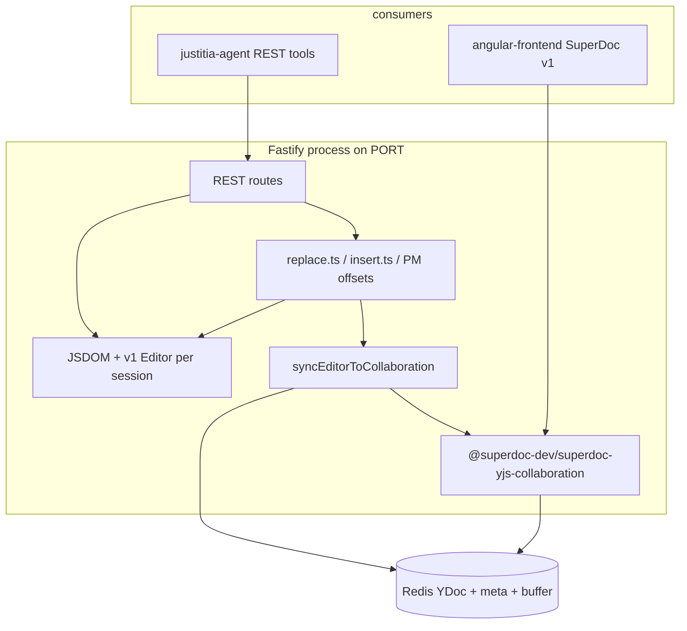
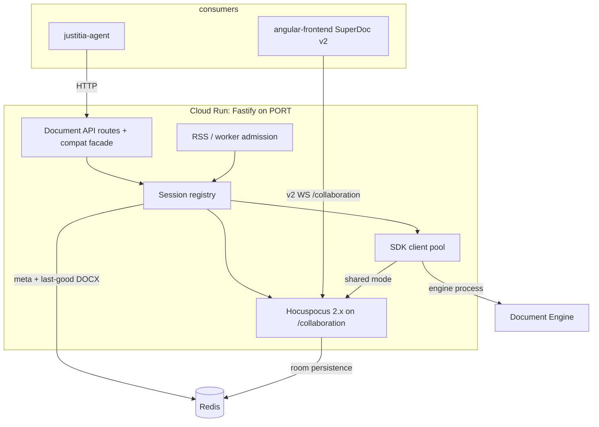
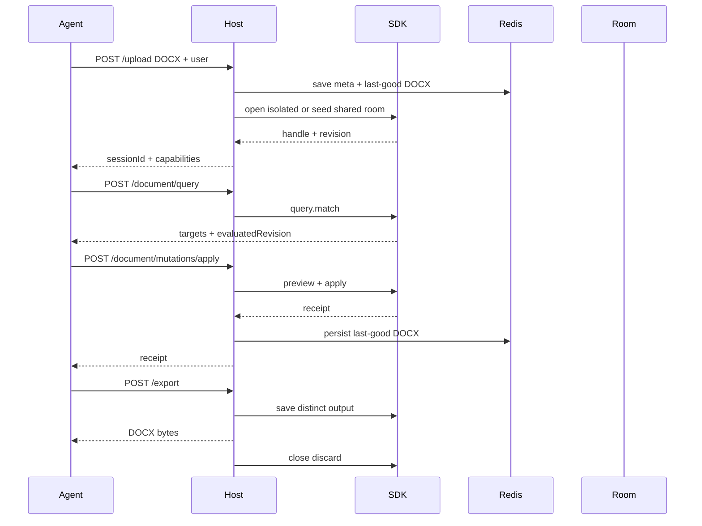
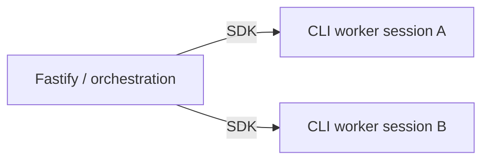
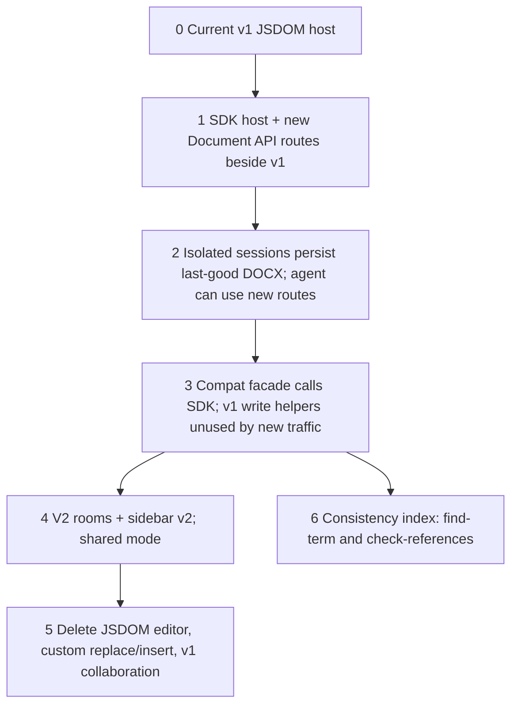

# SuperDoc Document Editor — Architecture Redesign

Companion to `ARCHITECTURE-SPINE.md`. This is the discussion document: current system, SuperDoc's 2026 Document API, the target host, and the cutover. The spine is the consistency contract. This file is the explanation.

**Status:** architecture only. No implementation in this change.
**Date:** 2026-09-04
**Altitude:** the whole editor service plus its two known consumers.

---

## 1. Why this exists

This repo is a headless SuperDoc host. An external agent (`justitia-agent`) uploads a DOCX, searches and edits it over HTTP, then exports. The Angular sidebar can also attach to the same session over a collaboration websocket.

That host was built against SuperDoc v1: a JSDOM-backed `Editor`, homemade ProseMirror transactions, homemade tracked-change marks, and a custom Yjs bridge so REST edits could appear in the browser.

SuperDoc now publishes a different integration:

- one **Document API** (query → target → mutate → receipt) for browser and headless
- official Node SDK (`@superdoc/sdk`) that manages an engine process instead of the v1 `Editor`
- atomic **mutation plans**
- stable-enough **block addresses** (`paraId` / `NodeAddress`)
- SDK clients that can **join the same v2 collaboration room** as the browser
- an explicit safety model (tracked mode, separate output, receipts, attributed authors)

The old internal specs (`document_editor_redesign.md`, the three LLD phases, `document-editor-redesign-spec.md`, `document_editor_plan.txt`) are now in this repo. §3 is a reading of those files, not a reconstruction. The target in §5 still uses SuperDoc's 2026 Document API as the implementation — the older `DocumentEditingPort` / DIY ProseMirror adapter is not revived. Several older rules that the first spine missed (compact outline, visible bulk-replace sets, content preconditions, typed failure codes, preview isolation, and the real Phase 3 consistency index) are now binding ADs.

---

## 2. What we run today



Facts that matter for the redesign:

| Area | Current behavior | Why it hurts |
| --- | --- | --- |
| Editing | `replaceTextWithFormatting` and friends fabricate `trackInsert` / `trackDelete` marks from ProseMirror `from` / `to` | Fragile across runs, lists, tables, track-over-track, newlines, NBSP |
| Addressing | Integer PM offsets are the agent contract; `paraId` was bolted on later | Offsets move after every edit; agents retry the wrong range |
| Runtime | One JSDOM window + SuperDoc editor per live session inside Fastify | RSS spikes on upload, rehydrate, replace-all, export; memory guard is a circuit breaker, not a design |
| Consistency | REST writes PM, then a host-owned snapshot/update is applied to a YDoc | Two documents, two update strategies, races with live browsers |
| Collaboration | v1 SuperDocCollaboration; websocket accept requires an in-memory session | Redis-only sessions cannot join; v2 editors cannot use these rooms |
| Export | `editor.exportDocx`, then drop in-memory maps and leave Redis | An "exported" session can be rehydrated; README still describes a second port |
| SuperDoc | `@harbour-enterprises/superdoc` 1.46.x, JSDOM `isHeadless: true` | v1 internals. SuperDoc now tells integrators not to use those packages |

The agent loop is still: upload → search/get-content → replace/insert by position → export. `justitia-agent` treats **404 as session expiry** and retries only **429/503**. Paragraph endpoints already return **400** for content errors so they are not mistaken for expiry. That status contract stays.

---

## 3. What the older specs actually said

The files are at the repo root. `document_editor_redesign.md` is the later problem analysis (SDK path chosen; commercial partnership resolves AGPL). `document-editor-redesign-spec.md` is the earlier draft that still treats license as open. `document_editor_plan.txt` is the Harvey / Nutrient research note. The three LLDs are the *how*.

The first architecture run reconstructed Phase 3 as “REST vs Yjs.” That was wrong. Phase 3 is defined-term consistency, cross-reference drift, and the numbering ripple. Shared-room dual-write is a real brownfield problem; it is AD-8 / AD-21, not the old Phase 3.

### 3.1 The three problems (still true)

**A — Bad edits.** The agent edits by character offset against a flattened view. Offsets shift after every edit. Insert protection only treats `paragraph` as a block, so “add a line at the top” lands *inside* a Heading 1. Tables, nested lists, headers, footers, footnotes, text boxes, and content controls are invisible or collapsed.

**B — Search / replace loops.** Failures return a bare “not successful.” `replace-all` returns a count, not what or where. Post-edit verification is a ~160-character window, so a defined term 30 paragraphs away is invisible and the agent blind-searches again.

**C — Memory.** Each open document holds a JSDOM, a live SuperDoc editor, and up to 100 MB of YDoc for the whole session, even when idle. JSDOM is injected as a global `window` / `document`, so concurrent conversions can race.

The design principle those specs settled — and Harvey and Nutrient independently published — is: **an LLM should edit a document the way an IDE edits code**, against a stable typed structure with validated operations, not the way `sed` edits a buffer. Insertions anchor relative to existing elements. A validation boundary rejects structure-breaking edits before they apply. The agent self-verifies against a structured diff. **Do not have the model read or write OOXML.**

### 3.2 What they proposed vs what we take

| Older proposal | SuperDoc 2026 equivalent | This architecture |
| --- | --- | --- |
| `get_structure` / `get_block` with `blockId`, role, numbering label `4.2(a)`, parent/depth | `extract` / `info` / `lists.get` (marker, path, level) / `getNode` / `projectHtml` redline | **Keep the agent contract (AD-24).** Compact outline, full text on demand. Do not walk `editor.state` or `NumberingManager`. |
| `DocumentEditingPort` + `SuperdocLocalAdapter` now, `SuperdocSdkAdapter` later | Document API *is* the port | **Do not build the local adapter.** SDK only (AD-2). |
| `mode: preview \| commit`, PM `tr` dry-run, txn snapshot / rollback | `mutations.preview` / `mutations.apply` `{ atomic: true }` | **Adopt the SDK.** Add invisible-preview (AD-27) and risk-class defaults. |
| `precondition.expectedText` | SuperDoc has `expectedRevision`, not clause-text guards | **Keep both (AD-26).** Today’s `expectedContext` on `/replace-in-paragraph`. |
| `find-matches` + `apply-batch` instead of `replace-all` | `query.match` `{ require: 'all' }` | **Keep the visible-set contract (AD-25).** A count is not a verification surface. |
| Typed error enum (`AMBIGUOUS_MATCH`, `WOULD_SPLIT_BLOCK`, `WOULD_DAMAGE_TRACKED_CHANGE`, …) | SuperDoc receipt `failure.code` | **Copy SuperDoc codes; host-fill the gaps (AD-13).** Never a bare “not successful.” |
| DIY: hold ProseMirror JSON at rest; pool happy-dom only for import/export | `@superdoc/sdk` process isolation (package was `@superdoc-dev/sdk` in the old docs) | **SDK path (AD-7).** Recycle workers on memory/idle. Not “zero DOM.” DIY / Aspose / Clippit only if a measured spike fails. |
| On-demand Yjs: live doc only when a viewer connects | Isolated DOCX vs shared v2 room | **Already AD-8 / AD-20.** Isolated is the agent production path until sidebar v2. |
| Phase 3 consistency index: `find-term`, `check-references`, ref drift after structural insert | SuperDoc does not ship this | **Keep as AD-28.** Ships after isolated Document API cutover. Terms patch on touched blocks; refs re-resolve globally. Do not auto-fix drift. |
| Field refresh on export (`REF` / number caches go stale) | Unknown on SDK 2.8.0 | **AD-10.** Spike must answer old Q-A4. |
| Phase 0 on the current JSDOM stack (heading-as-block, typed errors, mandatory context) | Facade fail-closed + structural insert | **Optional tactical work.** Not a second target. Must not extend `replace.ts`. |
| Human approval later on the same preview seam | Same `mutations.preview` payload | **Deferred.** AD-27 is the seam. No human UI now. |

### 3.3 What we reject from the older plan

- A shippable `SuperdocLocalAdapter` that applies ProseMirror transactions in this process.
- ProseMirror JSON as the durable at-rest document. Last-good DOCX is durable (AD-10).
- Host-minted 8-hex `blockId`s on the wire for cells / tables / sections. SuperDoc `NodeAddress` / `paraId` only; `sdBlockId` stays off the wire (AD-3).
- License as an open build-vs-buy gate. The later redesign and the 2026-07-05 plan update treat the commercial partnership as resolving AGPL. Remaining gates are fidelity and memory (open questions).
- “Zero DOM.” The Document Engine still bundles a DOM (`happy-dom`) inside the worker. The win is no JSDOM SuperDoc in the Fastify heap for a session lifetime.
- Treating Phase 3 as collaboration sync. One write path is AD-8; the numbering ripple is AD-28.

### 3.4 The load-bearing Phase 3 example (do not lose this)

Auto-numbered section 6. P3 is “6.3 Termination…”. P9 says “Termination is governed by **Section 6.3**.” The agent inserts Confidentiality after 6.2. Auto-numbering makes the new clause 6.3 and Termination 6.4. P9’s text is unchanged, so `touchedBlockIds` contains neither P9 nor P3. If maintenance only re-scans touched blocks, `check_references()` reports “all good” while P9 now points at Confidentiality.

**After any structural edit, re-resolve all refs against fresh outline labels and flag drift.** Do not auto-fix. That rule is AD-28.

---

## 4. What SuperDoc now gives us

Verified 2026-09-03 against [docs.superdoc.dev](https://docs.superdoc.dev/) and npm.

| Surface | Package | Role |
| --- | --- | --- |
| Document API | contract, not a package | query, target, mutate, receipt — same names in browser and headless |
| Node automation | `@superdoc/sdk` **2.8.0** | typed handle; pulls `@superdoc/sdk-<platform>` binaries (not npm `@superdoc/cli`) |
| CLI (sibling surface) | `@superdoc/cli` **0.31.0** | shell/CI only; do not install it into this host |
| Browser editor | `superdoc` **2.11.0** | v2 engine; `editor.doc` is the Document API |
| Agent toolkit | `@superdoc/sdk` `createAgentToolkit` | optional; we are **not** embedding it in this host |
| Collaboration | v2 rooms via Hocuspocus, y-websocket, or Liveblocks | SDK can join the same room as the browser |

Do **not** integrate `@superdoc/headless` or `@superdoc/document-api-v2-adapter`. SuperDoc documents those as implementation details.

### 4.1 The operation loop

```ts
const match = await doc.query.match({
  select: { type: 'text', pattern: 'termination' },
  require: 'exactlyOne',
});
const receipt = await doc.replace(
  { target: match.items[0].target, text: 'cancellation' },
  { changeMode: 'tracked', expectedRevision: match.evaluatedRevision },
);
if (!receipt.success) throw receipt.failure;
```

Rules SuperDoc already enforces and this host must not weaken:

- A target or ref is valid only for `evaluatedRevision`.
- `require: 'exactlyOne'` is the safe default when one clause must change.
- Pending tracked deletions are excluded from text queries unless asked for.
- `sdBlockId` is session-scoped. Cross-open identity is `query.match` / `paraId` `NodeAddress`.
- Success is `receipt.success`, not "the call did not throw".
- Stale-revision codes: re-query, retry **once**, keep `expectedRevision`.

### 4.2 Mutation plans

Several edits that are one logical change:

1. `query.match` each target (same revision).
2. `mutations.preview(plan)` — no writes.
3. `mutations.apply({ atomic: true, changeMode: 'tracked', expectedRevision, steps })`.

If compilation, targeting, or revision checks fail, no step is applied.

### 4.3 Reads that replace `get-content`

| Need | Operation |
| --- | --- |
| Compact outline (AD-24) | Host projection over `extract` / `info` / `lists.get` — not a raw dump |
| One block, redline + surviving | `getNode` + `projectHtml({ reviewMode: 'redline' \| 'final' })` |
| Structured blocks + comments + tracked changes | `doc.extract()` |
| Counts / outline metadata | `doc.info()` |
| List numbering label (`4.2(a)`) | `doc.lists.get` (`marker`, `path`, `level`) |
| Review HTML / Markdown with source map | `doc.projectHtml` / `doc.projectMarkdown` |
| Mutation-grade search | `doc.query.match` |
| Discovery-only search | `doc.find` (not for writes) |
| Bulk find-set (AD-25) | `query.match` plus host exclusion reasons |
| Defined term / ref drift (AD-28, later) | Host index over outline + text; not a SuperDoc primitive |

`projectHtml({ reviewMode: 'redline' | 'final' | 'original', includeSourceMap: true })` is the replacement for homemade HTML with `<ins>` / `<del>` and homemade position maps. The outline route must stay token-lean (preview only). Full text is a per-block call.

### 4.4 Shared rooms from the SDK

```ts
const doc = await client.open({
  doc: lastGoodDocxPath,
  collaboration: {
    providerType: 'hocuspocus',
    url: roomUrl,
    documentId: sessionId,
  },
});
```

If the room already has content, `doc` is ignored and the SDK joins. If the room is empty, the DOCX seeds it. On `@superdoc/sdk` 2.8.0, reopen of a populated room is `roomMode: 'join'`. Do not copy `onMissing: 'error'` from `@superdoc-dev/sdk` docs — that field is not on the 2.8.0 types. First seed happens only inside `promoteToShared`.

This is the consistency answer. The agent and the sidebar become two clients of one room, not two stores the host reconciles.

### 4.5 Safety we adopt as host policy

From SuperDoc's agent safety guide:

- consequential edits are `changeMode: 'tracked'`
- write a distinct output; do not overwrite the only copy
- close the handle on every path
- attribute a real user, not `CLI`
- do not log document text
- do not dispatch unadvertised toolkit names (`superdoc_execute_code`, `agent_*`) — irrelevant if this host does not embed the toolkit, and a reason not to

---

## 5. Target architecture

### 5.1 Picture



The host is no longer an editor. It is:

1. an HTTP adapter for Document API operations
2. a session and identity boundary
3. a Hocuspocus 2.x room adapter on `/collaboration` (same port)
4. a persistence adapter for last-good DOCX and room bytes
5. admission control and telemetry

### 5.2 Two access modes

| Mode | When | How the handle opens | Who else is connected |
| --- | --- | --- | --- |
| **Isolated** | Agent-only job, no live human | `client.open({ doc: lastGoodDocx })` | nobody |
| **Shared** | After `promoteToShared` | `client.open({ collaboration, roomMode: 'join' })` | SuperDoc v2 browser clients |

`documents` is the only writer of `accessMode`. Upload writes isolated unless the caller requested shared and `promoteToShared` succeeds. A request must not silently switch modes. Advertising `collaborationUrl` does not set shared.

Shared mode cannot ship before the sidebar is on SuperDoc v2. Until then, isolated mode is the production agent path. Existing v1 rooms remain the human-visible path for the current sidebar; the SDK never joins them. Do not create v2 rooms or return a v2 `collaborationUrl` in that window.

### 5.3 Session lifecycle



Warm handles are optional. TTL, memory pressure, deploy, and crash all recover from Redis last-good DOCX (isolated) or from the room (shared). There is no "rehydrate by stuffing a YDoc into a JSDOM editor."

### 5.4 Where state lives

| State | Isolated | Shared |
| --- | --- | --- |
| Live document | SDK engine process behind the handle | v2 Hocuspocus room |
| Durable snapshot | last-good DOCX in Redis | last-good DOCX (host snapshot) |
| Recover on restart | last-good only | room blob if present; else seed last-good |
| Identity / TTL / mode | session meta in Redis | same |
| Browser presence | none | room awareness |

Export always produces a **new** artifact. It does not become the only copy of the pre-export document.

### 5.5 Process and memory



- Fastify does not load JSDOM SuperDoc and does not inject a global `window` / `document`.
- Each open document is an SDK-managed engine process. 2.8.0 default is the embedded platform binary (`processMode: 'cli'`); `documentHostPath` is an alternate host, not a reason to npm-install `@superdoc/cli`.
- Recycle a worker on a memory ceiling or idle TTL so the OS reclaims native memory. That is the answer to JSDOM retention. The engine still uses a DOM inside the worker; we are not claiming “zero DOM.”
- Admission rejects upload, heavy plans, export, and re-open when RSS or worker slots are exhausted (503 + `Retry-After`).
- Close is best-effort in `finally` so a failed edit cannot leak a worker.

This is the replacement for Phase 2’s Design B. Design A (JSON at rest + shared happy-dom) and Aspose / OpenXML+Clippit stay fallbacks only if a measured SDK fidelity or memory spike fails. We still need a measured budget (open question): how many representative contracts fit in 8 GiB.

### 5.6 Collaboration without a host-owned bridge

Shared mode:

1. `documents.promoteToShared` creates the Hocuspocus 2.x room (`documentId` = `sessionId`) and seeds it from last-good if empty.
2. Sidebar joins `/collaboration` with SuperDoc v2 (`v2Collaboration`, `roomMode: 'join'`, keep `?room=` until env configs change).
3. Agent operations open an SDK handle with `roomMode: 'join'` on that same `documentId`.
4. Tracked changes and comments appear in the sidebar because they were applied by the engine in the room, not because we copied marks into a YDoc.

V1 rooms are a different format. Do not connect a v2 editor to them. The frontend rollout and the shared-mode cutover are one change.

Room create vs join stays explicit. SuperDoc v2 has no join-or-create.

### 5.7 Identity, comments, review

- Upload already accepts a user. That user is required and is passed into `SuperDocClient` / `open`.
- Comments use `doc.comments.create` / `list` / `patch` with a query target.
- Tracked changes use `doc.trackChanges.list` / `get` / `decide`.
- Agent tool surfaces should **exclude** accept/reject so a person remains the reviewer. HTTP review endpoints may exist for the sidebar or internal tools, but they are not the agent default.

---

## 6. HTTP surface

### 6.1 Canonical routes (new)

Names can move; the shapes must stay Document API-shaped.

| Route | SuperDoc operation | Notes |
| --- | --- | --- |
| `POST /upload` | open + persist last-good DOCX | keep `sessionId`, `fileName`, `collaborationUrl`; `userid` + `username` required (breaks today's anonymous default) |
| `POST /document/query` | `query.match` | returns items, targets, refs, `evaluatedRevision`; discovery also returns exclusions (AD-25) |
| `POST /document/structure` | host projection over `extract` / `info` / `lists.get` | compact outline (AD-24); token-lean |
| `POST /document/block` | `getNode` + redline/final project | full text, surviving text, children |
| `POST /document/extract` | `extract` / `info` | replaces most `get-content` metadata uses |
| `POST /document/project` | `projectHtml` / `projectMarkdown` | review views + optional source map |
| `POST /document/replace` | `replace` | target or ref + `expectedRevision` + `expectedText` (AD-26) + `changeMode` |
| `POST /document/insert` | `insert` / `create.paragraph` | structural `before` / `after` / `inside*`; insert-at-top is `before` first block |
| `POST /document/delete` | `delete` / `blocks.delete` | |
| `POST /document/mutations/preview` | `mutations.preview` | invisible (AD-27); does not persist or leak to the room |
| `POST /document/mutations/apply` | `mutations.apply` | atomic plans; per-item receipts for bulk sets |
| `POST /document/find-term` | host index (AD-28) | later; definition + occurrences |
| `POST /document/check-references` | host index (AD-28) | later; dangling + drifted |
| `POST /document/comments` | `comments.create` / `patch` | |
| `GET /document/comments` | `comments.list` | |
| `GET /document/track-changes` | `trackChanges.list` | |
| `POST /document/track-changes/decide` | `trackChanges.decide` | not advertised to the agent by default |
| `POST /export` | save distinct DOCX | binary response unchanged |
| `GET /health`, session validate/list/delete | host | unchanged meanings |

Every mutation response includes a receipt: `success`, operation, `failure.code` if any, before/after revision, and tracked-change ids when present. Absence of an exception is not success. Agent-correctable failures always include a typed `code` and `detail` (AD-13). Preview responses include a structured diff (`before` / `after` / `surviving` / `touchedBlockIds`) and never persist.

### 6.2 Compatibility facade (temporary)

justitia-agent will not move atomically. Map what maps cleanly; do not preserve offsets as a feature.

| Current route | Facade behavior |
| --- | --- |
| `POST /search` | `query.match` with `require: 'any'` and **case-sensitive** match to keep today's agent behavior; ranges if present are display-only |
| `POST /get-content` | `extract` or `projectHtml` |
| `POST /replace-in-paragraph` | `query.match` scoped to that `paraId` + `replace` |
| `POST /insert-after-paragraph` | `create.paragraph` / structural insert `after` that address |
| `POST /replace-all` | AD-25 find-set then one atomic plan; **not** a bare count |
| `POST /replace` with `from` / `to` | **fail closed (400).** Use query or paragraph tools. |
| `POST /insert-content` with `position` | **fail closed (400).** `afterParaId` / query address stays |
| comments / track-changes / export / upload | thin wrappers over Document API |

Facade routes keep today's status-code meanings (AD-17). They must call the SDK, not `editor/replace.ts`.

### 6.3 Frozen error contract

| HTTP | Meaning | Agent behavior today |
| --- | --- | --- |
| 404 | session missing or expired | do not retry this session |
| 400 | bad input, no match, ambiguous match, stale context, missing user | fix the request |
| 503 | memory / worker / persist admission | retry with `Retry-After` |
| 429 | overload / rate limit only | retry; never use for content errors |

Do not use 404 for "paragraph not found".

---

## 7. Consumers

### 7.1 justitia-agent

Stays on HTTP. Gains Document API tools. Loses dependence on PM offsets. The older LLD’s tool list maps onto this host as:

| Older tool | This host |
| --- | --- |
| `get_structure` / `get_block` | `/document/structure`, `/document/block` |
| `replace_in_block` / `set_block_text` | `/document/replace` with `NodeAddress` + `expectedText` |
| `insert_block` / `delete_block` / `move_block` | `/document/insert`, `/document/delete`, structural plan steps |
| `find_matches` / `apply_batch` | `/document/query` (matches + exclusions) + `/document/mutations/apply` |
| `commit` / `rollback` | apply vs discarded preview (AD-27); no second txn store |
| `find_term` / `check_references` | `/document/find-term`, `/document/check-references` after AD-28 ships |

Required companion work in that repo (not this PR):

- new tools aligned to §6.1
- system prompt: read structure → address by `NodeAddress` / query → supply `expectedText` → preview risky ops → apply → read receipt
- stop teaching `to` vs `to + 1` and remove the coordinate-fallback section
- keep `SUPEREDITOR_*` env and the 404/503 semantics
- drop accept/reject from the default tool list
- do not type list-number prefixes; use `asListItem` / engine numbering
- after AD-28: plan term/ref ripple *before* structural edits, then run `check_references` as a backstop

### 7.2 angular-frontend sidebar

Shared mode requires SuperDoc **v2**:

- package `superdoc` 2.11.x (not `@harbour-enterprises/superdoc` 1.x)
- `v2Collaboration` with create-then-join
- Document API for any in-browser automation (`superdoc.activeEditor.doc`)
- same room id as this host's `sessionId`

Until that ships, isolated mode is the agent production path. Do not run a v2 SDK against a v1 room.

---

## 8. Cutover

No calendar estimates. Each step is a technical gate.



| Step | In this repo | Outside this repo | Exit gate |
| --- | --- | --- | --- |
| 1 | `@superdoc/sdk` host, new `/document/*` routes, isolated open/save/close | none | query + tracked replace + export on a fixture without JSDOM; insert-above-heading and table-cell cases pass |
| 2 | last-good DOCX persistence; re-open after TTL | agent may start calling `/document/query` | kill the process, re-open session, export matches |
| 3 | compat facade; stop calling `replace.ts` for facade traffic; AD-25 find-set on `/replace-all` | agent dual-writes old and new tools | replace-regression cases pass through the facade or are retired with a documented miss; `/replace-all` returns matches, not a count |
| 4 | Hocuspocus 2.x on `/collaboration` | sidebar SuperDoc v2 + env lockstep | two browsers + one SDK handle see the same tracked edit |
| 5 | delete v1 editor stack | agent removes offset tools | no JSDOM SuperDoc import remains |
| 6 | AD-28 consistency index | agent `find_term` / `check_references` + prompt ripple step | Section 6.3 drift fixture flags the drifted ref; defined-term change leaves no stray occurrences |

Step 4 is blocked on the frontend. Steps 1–3 are not. Step 6 is after the isolated Document API path is the writer.

**Optional, not on this cutover:** Phase 0 patches on the current JSDOM stack (heading-as-block in `insert.route.ts`, typed error codes, mandatory `expectedContext`). High leverage, low risk, independent of the SDK. Must not grow `replace.ts`.

Fidelity on steps 1 and 6 uses the named torture corpus: insert-above-heading, table-cell edit, nested-clause renumber, defined-term ripple, track-over-track, Section 6.3 reference drift.

---

## 9. What we will not do

- Rebuild a better `replace.ts`. The Document API replaces it.
- Keep JSDOM SuperDoc as a "fallback editor."
- Build `SuperdocLocalAdapter` / in-process `prosemirror-transform` as a shippable write path.
- Hold ProseMirror JSON as the durable document. Last-good DOCX is durable.
- Edit raw OOXML (`document.xml` string-replace). Run fragmentation is a Word problem; Microsoft warns this corrupts files.
- Switch to Aspose / Open XML SDK + Clippit unless a measured SDK fidelity or memory spike fails — and then only as a new architecture run.
- Claim “zero DOM.” The engine still needs DOM APIs inside the worker.
- Make Yjs the agent-facing document model.
- Put `createAgentToolkit` or SuperDoc MCP in this host. This host is deterministic. The model lives in justitia-agent.
- Let justitia-agent call Python `superdoc-sdk` and skip this host. That drops session, identity, analytics, admission, and shared rooms.
- Auto-accept agent tracked changes.
- Auto-fix reference drift (AD-28 flags; the agent or a human decides).
- Dump the consistency index to the model. Answers only.
- Log clause text "for debugging."
- Reintroduce boot-time `lsof | kill` or a second public port.
- Mint host-owned cell / table `blockId`s as a cross-open wire identity.

---

## 10. Open questions

1. **Worker budget.** Measure SDK/engine-process RSS on representative SpotDraft contracts. Size warm-handle limits from that number, not from the current 7680 MB JSDOM guard.
2. **Sidebar v2 date.** Shared mode is gated on it. Isolated mode is not.
3. **Chainguard vs `@superdoc/sdk-linux-x64` 2.8.0.** Must be executed before step 1 ships. FIPS/glibc fit is unverified.
4. **License key on SDK 2.8.0.** Keep `SUPERDOC_PUBLIC_LICENSE_KEY` required until a cutover proves the client ignores it.
5. **Immutable original DOCX.** Keep an upload-time original only if `reviewMode: original` cannot be served from SuperDoc's original-view projection.
6. **Field refresh.** Does SuperDoc export refresh `REF` / number fields or only emit them dirty? (AD-10; old LLD Q-A4.)
7. **Outline numbering.** Does `extract` / `info` already include computed labels for every list item, or must the host call `lists.get` per item? (AD-24.)

---

## 11. How this maps to the spine

| Decision | One-line rule |
| --- | --- |
| AD-1 | Document API is the only writer |
| AD-2 | `@superdoc/sdk` only; no v1 Editor internals |
| AD-3 | Query and public IDs, not PM offsets |
| AD-4 | Multi-edit = atomic plan |
| AD-5 | Tracked by default |
| AD-6 | Handle lifecycle; isolated recovers last-good, shared recovers the room |
| AD-7 | Engine behind the SDK process boundary |
| AD-8 | Isolated or shared; `documents` owns `accessMode` |
| AD-9 | SuperDoc v2 Hocuspocus 2.x; `/collaboration`; no v2 rooms until sidebar v2 |
| AD-10 | `documents` is the only last-good writer; export does not end the session |
| AD-11 | Agent still talks HTTP here; frozen facade paths and `SUPEREDITOR_*` |
| AD-12 | `userid` + `username` required; anonymous upload is a break |
| AD-13 | `documents` retries stale once; 200 means receipt plus persist |
| AD-14 | No document text in logs; upload analytics once after first persist |
| AD-15 | One Cloud Run port; `instrumentation.ts` first |
| AD-16 | Isolated writer first; v1 sidebar rooms stay until shared ships |
| AD-17 | 404 / 400 / 503 / 429 meanings frozen |
| AD-18 | `documents` is the only session-exists predicate |
| AD-19 | Versioned meta / last-good / optional original / optional room keys |
| AD-20 | `promoteToShared` is the only room create |
| AD-21 | Shared live body is the room; last-good is a snapshot |
| AD-22 | One admission function for HTTP and websocket |
| AD-23 | SuperDoc license key stays required until measured otherwise |
| AD-24 | Compact outline with numbering; tables/footnotes visible; full text on demand |
| AD-25 | Bulk change is a visible match set, never a bare count |
| AD-26 | `expectedText` / `expectedContext` sits beside `expectedRevision` |
| AD-27 | Preview never persists or leaks to the room; apply is the only visible write |
| AD-28 | Host consistency index: terms patch locally, refs re-resolve globally; no auto-fix |

---

## 12. Suggested next workflow

1. Review the spine (AD-1–AD-28) and this companion. Binding text is the spine.
2. Run `bmad-spec` if you want a capability contract with stable `CAP-n` ids for the new routes.
3. Run `bmad-create-epics-and-stories` against the cutover in §8 — one epic per step, stories that a builder can implement without re-deciding the ADs.
4. Measure `@superdoc/sdk-linux-x64` on Chainguard `node-fips:20` before writing step 1 code.
