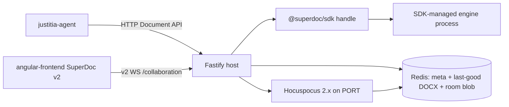

# Architecture Spine — SuperDoc Document-Engine Host

## Design Paradigm

This service is a **document-engine command host**. SuperDoc's Document Engine is the only component that may change a DOCX. HTTP routes, session storage, and collaboration rooms are adapters around that engine.

The engine contract is fixed:

```text
open → inspect → query → target → mutate → inspect receipt → persist → close
```

A model or agent may choose an operation. The host must not invent a second editor, a second coordinate system, or a second write path.



## Inherited Invariants

None. Initiative altitude; no parent spine.

## Architecture Decisions

### AD-1 — Document API is the only mutation authority

- **Binds:** all
- **Prevents:** a second home-grown editor, sync, or mark-fabrication stack beside SuperDoc
- **Rule:** Every document change is a Document API operation on a bound handle. The only durable writes of document bytes are (a) `documents` persisting an engine export as last-good DOCX, and (b) the v2 room protocol applying Document API operations from a joined client. Persistence stores opaque blobs; it does not merge Yjs. Host code must not write ProseMirror transactions or fabricate `trackInsert` / `trackDelete` marks. Import-time DOCX normalize may run once before first `open`. Post-engine OOXML rewrite is forbidden except the bytes the SDK save/export already produced. Raw string-replace on `document.xml` (or any OOXML part) is not a write path: run fragmentation is a Word format property, and Microsoft's own docs warn that naive XML replace can corrupt the file. A second engine (Aspose, Open XML SDK + Clippit, in-process `prosemirror-transform`) is not a write path unless a measured SDK fidelity or memory spike fails and a new architecture run replaces this spine.

### AD-2 — Official SDK is the only Node integration surface

- **Binds:** hosts, documents, collaboration, persistence
- **Prevents:** JSDOM `Editor` internals, `@superdoc/headless`, `@superdoc/document-api-v2-adapter`, `@superdoc-dev/sdk`, and custom track-mark construction
- **Rule:** Node code talks to `@superdoc/sdk` document handles and sets `runtime` to `v2` when the client exposes that option. Do not import SuperDoc implementation packages. Do not install `@superdoc/cli` into this host to get the engine; 2.8.0 loads platform binaries (`@superdoc/sdk-linux-x64` and siblings). Do not keep `@harbour-enterprises/superdoc` as a write path after the cutover. Ignore leftover SuperDoc pages that still install `@superdoc-dev/sdk` or teach v1 `modules.collaboration`.

### AD-3 — Address content by query and public IDs, not offsets

- **Binds:** routes, agent-tools, sidebar-viewer
- **Prevents:** integer `from` / `to` / `position` becoming a targeting model on any mutate path, including the facade
- **Rule:** Host `Target` is a SuperDoc target or ref from `query.match` / `extract`, or a `NodeAddress` (`paraId` when SuperDoc exposes it). Mutation-grade query uses `require: exactlyOne` when one clause must change. `require: all` is the engine cardinality for an apply step after the match set is visible (AD-25), or when the caller explicitly opts into apply-all. `find` is discovery-only and is not a write locator. Pending tracked deletions stay excluded unless the caller sets `includeDeletedText`. After any mutation or reopen, query again. Facade `from` / `to` and `position` fail closed with 400. Do not put `sdBlockId` or any host-minted cell/table `blockId` on the wire. Insert-at-top is structural `before` the first addressable block, never a character position. The agent never types a list-number prefix; numbering is engine-owned (`lists.get` marker/path).

### AD-4 — Multi-edit work is an atomic mutation plan

- **Binds:** routes, agent-tools, documents
- **Prevents:** partially applied multi-step agent turns
- **Rule:** Two or more edits that must succeed or fail together use `mutations.preview` then `mutations.apply` with `atomic` true and a unique step id. One independent edit may use the matching direct operation. Preview validity is not a lock; apply still carries `expectedRevision`. Preview is invisible (AD-27). Cross-route turns are not one plan; the agent must not split one logical change across `/document/mutations/apply` and a compat write.

### AD-5 — Consequential agent edits are tracked

- **Binds:** documents, agent-tools, routes
- **Prevents:** silent direct rewrites of contract language
- **Rule:** Host default `changeMode` is `tracked`. Facade writes are always `tracked`. `direct` is allowed only on canonical `/document/*` routes when the caller sends an explicit flag **and** the operation is on the tracked-capable allowlist SuperDoc documents for that runtime (`capabilities()`). Operations SuperDoc applies directly even when `tracked` is requested must be refused or labeled direct in the receipt. Do not accept accept/reject of tracked changes from the agent.

### AD-6 — A session is a handle lifecycle; recovery is mode-specific

- **Binds:** documents, persistence, collaboration
- **Prevents:** immortal in-process editors, and last-good vs room fighting after a restart
- **Rule:** `documents` runs open, use, inspect receipt, persist, close. Close is best-effort in `finally` and also disposes the SDK client when it owns it. A warm handle is a cache. Isolated recovery uses last-good DOCX only; no room keys exist. Shared recovery uses the opaque room blob if present, and seeds from last-good only when the room is missing. Close of a host handle must not destroy a shared room. Room lifetime equals session lifetime.

### AD-7 — The engine stays behind the SDK process boundary

- **Binds:** hosts, documents
- **Prevents:** JSDOM SuperDoc living in the Fastify heap
- **Rule:** `hosts` owns SDK client / engine-process lifecycle and worker-slot admission. The API process owns HTTP, Redis, and the Hocuspocus 2.x room adapter. Document CPU and native memory run in the SDK-managed process (embedded CLI binary by default; `documentHostPath` only if measured later). Recycle a worker on a memory ceiling or idle TTL so the OS reclaims native memory; that is the answer to JSDOM retention, not “zero DOM.” The converter still needs DOM APIs inside the engine process. Do not import `superdoc` or happy-dom into the API process to “share” the engine. Do not inject a global `window` / `document` into Fastify (today’s JSDOM race). Do not keep a live editor or DOM in the API heap for an idle session.

### AD-8 — Isolated DOCX and shared room are the only two access modes

- **Binds:** documents, collaboration, routes
- **Prevents:** custom ProseMirror-to-Yjs dual-write, and two legal opens of opposite modes
- **Rule:** `documents` is the only writer of `accessMode`. Upload writes `isolated` unless the caller requested shared **and** `promoteToShared` succeeds in the same operation. Isolated open is illegal when mode is shared, and shared open is illegal when mode is isolated. Advertising `collaborationUrl` does not set shared. Agent-only work opens last-good DOCX. Human-visible work joins the v2 room. Never maintain a REST document and a collaboration document synced by a host-owned converter.

### AD-9 — Collaboration rooms are SuperDoc v2 Hocuspocus 2.x

- **Binds:** collaboration, sidebar-viewer, documents
- **Prevents:** mixing v1 rooms with a v2 editor, and host/sidebar picking different providers or ids
- **Rule:** Pin `@hocuspocus/server` 2.15.3 and `@hocuspocus/provider` 2.13.6 (SuperDoc v2 example and `superdoc` 2.11.0 peer; Hocuspocus 4.x requires Node 22 and is forbidden here). `documentId` equals `sessionId`. Public websocket base path stays `/collaboration`. Keep `?room=` as an alias for `documentId` until the sidebar env configs change in the same shared-mode rollout. Room create and join are explicit (`roomMode` on `@superdoc/sdk` 2.8.0). Shared SDK open is join-only. Do not create v2 rooms or return a v2 `collaborationUrl` until shared mode ships with the sidebar. Until then, existing v1 rooms remain the human-visible path; the SDK never joins a v1 room.

### AD-10 — Last-good DOCX is the durable snapshot; `documents` is the only writer

- **Binds:** documents, persistence, export, routes
- **Prevents:** Redis YDoc snapshots as the only recoverability, and three modules persisting last-good
- **Rule:** `documents` is the only caller of persist-last-good. Bytes come only from engine export of a host-bound handle. Persist after every successful Document API write that changes the DOCX, including comments, and after shared last-client-disconnect flush. Persist failure fails the HTTP mutation (503); do not return 200 on a successful receipt that did not persist. Export writes a distinct artifact, does not overwrite last-good, and does not delete the session. Export must leave Word `REF` / number fields correct or marked dirty so Word refreshes them on open; validate this in the SDK fidelity spike and add an engine field-update if cached field text stays stale. Isolated sessions have no room blob. Shared room blob is opaque and never used to overwrite an existing room on seed.

### AD-11 — This service remains the agent HTTP boundary

- **Binds:** routes, agent-tools
- **Prevents:** justitia-agent growing a second, unhosted SuperDoc write path
- **Rule:** justitia-agent keeps calling this host over HTTP. Env names stay `SUPEREDITOR_*` through the facade window. Canonical `/document/*` bodies are SuperDoc shapes plus `sessionId`. Upload stays one entrypoint and keeps JSON-or-multipart, upload-by-URL, and `{ sessionId, fileName, collaborationUrl, user }` in the 200 body. Frozen facade paths: `/upload`, `/search`, `/get-content`, `/replace`, `/replace-all`, `/insert-content`, `/add-comment`, `/get-comments`, `/export`, `/replace-in-paragraph`, `/insert-after-paragraph`. Facade may keep old request names; it must not emit writable `from` / `to` / `updatedRange` / PM selection. Search ranges, if present, are display-only.

### AD-12 — Every mutation has an explicit author

- **Binds:** documents, routes, hosts, comments, tracked changes
- **Prevents:** generic `CLI` authorship and a silent anonymous default
- **Rule:** Upload requires `userid` and `username`. Missing or `anonymous` is 400. This breaks today's optional-user upload that invents `anonymous@sidebar.com`. `hosts` maps that `UserInfo` to SuperDoc `open` user in one place. Browser awareness for the session human must use the same `userid`, or a guest list stored on the session record. Comment and tracked-change author for host operations is that session user.

### AD-13 — Receipts plus persist are success; `documents` retries stale once

- **Binds:** documents, routes
- **Prevents:** throw-less success, route-plus-agent retry storms, and 200 after a lost persist
- **Rule:** `documents` is the only retry owner. On `REVISION_MISMATCH`, `STALE_REVISION`, `ADDRESS_STALE`, or `TARGET_NOT_FOUND`, it re-queries and retries once. Routes and justitia-agent must not implement a second stale retry. Never drop `expectedRevision`. `NO_OP` and capability failures do not retry unchanged. Compare before/after revision before any retry. HTTP success for a mutation is `receipt.success` and last-good persist ok. Facade `{ success }` must equal `receipt.success`. After the single retry, stale / not-found / validation / ambiguous / context-guard are 400. Persist or engine-worker failure is 503. Never 200 plus a failed receipt on facade routes the old agent still calls. Every agent-correctable failure carries a typed `code` plus machine `detail` (never a bare “not successful”). Copy SuperDoc codes; when SuperDoc has no equivalent the host uses `AMBIGUOUS_MATCH`, `PRECONDITION_FAILED`, `STALE_TARGET`, `WOULD_SPLIT_BLOCK`, `WOULD_DAMAGE_TRACKED_CHANGE`, `STRUCTURE_VIOLATION`, or `INVALID_ANCHOR`. This is what stops search/replace loops.

### AD-14 — Telemetry never carries document text

- **Binds:** analytics, logs, documents
- **Prevents:** contract clauses and PII landing in logs or traces
- **Rule:** Log operation name, session id, failure code, receipt status, timing, and before/after revision. Do not log document text, full mutation payloads, or complete receipts. Facade operations map to Document API names in events. Amplitude `SuperDoc Document Opened` emits once from `documents` after the first durable last-good persist; rehydrate must not emit it. Empty `AMPLITUDE_API_KEY` stays a no-op. Shutdown flush must not init a quiet client.

### AD-15 — One public Cloud Run port and the existing boot path

- **Binds:** server, collaboration
- **Prevents:** a second listen port, boot-time process kill, or breaking Fastify instrumentation
- **Rule:** Fastify remains the public listener on `PORT`. Collaboration websocket shares that port. `instrumentation.ts` stays the first import. Entrypoint stays `node --import tsx`, no tini, no startup process killing. `package.json` `engines` is not the authority; `.nvmrc` 20 and Chainguard `node-fips:20` are.

### AD-16 — Compatibility is temporary; one writer stack at a time

- **Binds:** migration, editor, routes, collaboration
- **Prevents:** a permanent dual stack, and deleting v1 rooms before the sidebar can move
- **Rule:** Isolated Document API is the only writer for agent sessions until shared mode ships. While that is true, v1 collaboration may remain for the current sidebar only; it is not a writer for Document API traffic. When shared mode ships, it is one rollout: Hocuspocus 2.x, SuperDoc v2 sidebar, v2 `collaborationUrl`, v1 sockets off. Then delete `editor/replace.ts`, `editor/insert.ts`, JSDOM `createHeadlessEditor`, and v1 collaboration. Do not reimplement `from` / `to` as the long-term model.

### AD-17 — HTTP status meanings stay frozen

- **Binds:** routes, agent-tools, collaboration
- **Prevents:** justitia-agent treating a bad target as session expiry
- **Rule:** Unknown or expired session is 404 on HTTP and the same predicate on websocket join (rehydrate-on-miss; do not require an already-warm memory map). Validation, missing target, ambiguous match, context-guard, and stale-after-retry are 400. Capacity and persist/worker admission are 503 with `Retry-After`. 429 remains a retryable overload/rate-limit signal; do not send it for content errors and do not invent other 5xx as “please retry.” Room create-existing or join-missing is 400, not 404. Encrypted or unreadable DOCX at open is 400.

### AD-18 — `documents` is the session authority

- **Binds:** documents, persistence, collaboration, routes
- **Prevents:** memory, Redis meta, and room table each defining “session exists”
- **Rule:** A session exists when Redis meta and last-good exist (isolated), or meta, last-good, and room id exist (shared). Memory is a cache. HTTP 404 and websocket failure use that predicate and rehydrate on miss. `collaboration` must not keep a parallel session table. `persistence` deletes keys only when `documents` commands it.

### AD-19 — Session record keys and meta are versioned

- **Binds:** documents, persistence
- **Prevents:** `superdoc:buffer` meaning both original upload and last-good, and meta growing targeting maps
- **Rule:** Keys are `meta`, `last-good`, optional immutable `original` (upload bytes, only if original-view projection is required), and optional opaque `room`. Do not reuse the current buffer key for both original and last-good. Meta is owned by `documents`: `sessionId`, `UserInfo`, `accessMode`, `fileName`, `roomId` (equals `sessionId` or absent), `lastGoodRevision` (opaque SuperDoc value or null), `lastGoodAt`, `capabilities`. No search maps, no comment lists. TTL refreshes on read and write.

### AD-20 — Shared mode is one promote operation

- **Binds:** documents, collaboration
- **Prevents:** upload, first websocket, and SDK `open` each creating the room
- **Rule:** `promoteToShared` is the only room create. It creates the Hocuspocus 2.x room if missing, seeds from last-good if the room is empty, fails if a different room identity already exists, flips `accessMode` to shared, then allows shared opens. First human join and an explicit shared upload call it. After promote, every SDK `open` with collaboration is `roomMode: join`.

### AD-21 — Shared writers flush last-good; they do not fork the live body

- **Binds:** documents, collaboration, persistence
- **Prevents:** browser-only edits vanishing on restart, and host close killing the room
- **Rule:** In shared mode the live body is the v2 room. Host and browser are two Document API clients of that room. Last-good is a snapshot: after every successful host receipt, and after the last room client disconnects (`documents` joins briefly, engine-exports, persists, closes). `expectedRevision` is the SuperDoc room revision, passed through unchanged. Host must not mint revisions.

### AD-22 — One admission function

- **Binds:** hosts, documents, routes, collaboration
- **Prevents:** HTTP open succeeding while websocket join is rejected, or the reverse
- **Rule:** Upload, host open, heavy plan, export, `promoteToShared`, and websocket join all call the same admission check. Reject when host RSS (including rooms) or `hosts` worker slots cannot take the work: 503 plus `Retry-After` on HTTP, and a named close on websocket. Keep the current RSS threshold name `MEMORY_GUARD_RSS_MB` until the CLI budget is measured.

### AD-23 — SuperDoc license identity stays required

- **Binds:** host, documents
- **Prevents:** booting without org attribution or inventing a second license injection
- **Rule:** `SUPERDOC_PUBLIC_LICENSE_KEY` remains required at process start until a measured SDK 2.8.0 cutover proves the key is unused. Pass it into the SDK client or documented license config. Do not fall through to SuperDoc's unattributed default. This is process attribution, not the AGPL/commercial license question. The commercial SuperDoc partnership already covers hosted use of the engine and SDK.

### AD-24 — Agent structure is a compact outline, not a flattened string

- **Binds:** routes, agent-tools, documents
- **Prevents:** the half-blind agent view (tables collapsed to text, list nesting flattened, headers/footers/footnotes/content-controls invisible) and dumping a full extract into the model context
- **Rule:** The agent-facing “what is this document” read is a compact outline in document order. Each item has a SuperDoc `NodeAddress` / `paraId` (not a host-minted id), a semantic role (heading level, body, list item, table / row / cell, footnote, content control, section), parent and depth, a computed numbering label when the engine has one, a short text preview plus length, and whether the block has tracked changes. Tables, nested lists, footnotes, headers/footers, and content controls are nodes, not loose text. Full block text is on demand and includes both redline markup and surviving text. Numbering labels come from Document API `lists.get` (marker / path / level) or equivalent extract/info fields — not from walking `editor.state` or SuperDoc `NumberingManager` internals. Outline calls stay token-lean; do not return the full body on the outline route.

### AD-25 — Bulk change is a visible set, never a bare count

- **Binds:** routes, agent-tools
- **Prevents:** `replace-all` that returns only a count, so the agent cannot verify and loops on search
- **Rule:** “Change X everywhere” is two steps. Discovery returns every match (address, snippet, context) **and** every exclusion with a reason (look-alike, wrong block type, inside a larger word, heading/footnote scoped out). Apply is one atomic plan over the chosen set and returns per-item receipts (before / after / surviving, or the SuperDoc receipt). Facade `/replace-all` must not use a bare count as the verification surface. `require: all` is the apply-step cardinality after the set is visible, or an explicit apply-all opt-in. Semantic defined-term resolution (`find-term`) is AD-28 and may replace substring discovery later.

### AD-26 — Content precondition sits beside revision

- **Binds:** routes, documents, agent-tools
- **Prevents:** applying a still-valid revision to a block whose clause text is no longer the one the agent read
- **Rule:** Every single-block text mutation accepts `expectedText` / `expectedContext` (today’s `/replace-in-paragraph` field). When present, that string must appear in the addressed block before apply. Failure is `PRECONDITION_FAILED` or `STALE_TARGET` and HTTP 400. This is in addition to `expectedRevision`. Facade paragraph tools keep the field. Canonical `/document/*` must accept it and check it before apply. Revision alone is not proof of clause identity.

### AD-27 — Preview is invisible; only apply is visible

- **Binds:** documents, routes, collaboration
- **Prevents:** dry-runs leaking to last-good, room viewers, or a later apply seeing a half-written document
- **Rule:** `mutations.preview` and any host `mode: preview` do not persist last-good, do not push to a shared room, do not change the session revision, and do not become visible to connected viewers. Only a successful apply/commit does those things. Human approval later reuses this same preview payload; do not build a second pending-edit store. Risk-class default: single-block replace / set-text with no tracked-change overlap may apply in one call; insert / move / delete and any overlap with another author’s tracked change default to preview-first.

### AD-28 — Consistency index is host-owned planning state

- **Binds:** documents, routes, agent-tools
- **Prevents:** treating “consistency ripple” as REST-versus-Yjs; re-scanning only touched blocks for references; dumping the index to the model; auto-fixing drift
- **Rule:** After the isolated Document API cutover, the host owns a session-scoped consistency index used only as answers to planning queries: `find-term` (definition block + occurrences) and `check-references` (dangling + drifted). The agent never receives the raw index. Term occurrences invalidate on the committed `touchedBlockIds` (`O(changed)`). Cross-reference resolution depends on global numbering: after any structural insert / delete / move, re-resolve **all** refs against fresh outline labels (a map lookup, not a text rescan). Flag drift — “this `Section 6.3` now points at a different block” — and do not auto-fix. Auto-numbered lists self-heal in the engine; manually numbered (literal-text) sections require the agent to plan a renumber cascade. Field-based refs depend on AD-10 field refresh. These rules are binding when the capability ships; do not implement the index by walking JSDOM `editor.state`.

## Consistency Conventions

- Document API names, inputs, targets, receipts, and failure codes are copied from SuperDoc, not renamed.
- Public block identity is `NodeAddress` / `nodeId`; for imported DOCX paragraphs that means native `paraId` when SuperDoc exposes it. Session-scoped `sdBlockId` is not a cross-open key.
- Mutation-ready refs are valid only for the `evaluatedRevision` that produced them. After close/reopen, clients query again.
- Isolated vs shared is an explicit session mode owned by `documents`.
- Facade `/search` stays case-sensitive to match today's agent; canonical `/document/query` documents SuperDoc's default case-insensitive match and accepts an explicit case flag.
- Agent accept/reject of tracked changes is off.
- Compatibility routes call the SDK; they must not reopen the JSDOM editor.
- If anyone later adds `createAgentToolkit`, dispatch only advertised tool names. Never pass through `superdoc_execute_code` or `agent_*`.
- Save/export uses a distinct output path and does not set SuperDoc `force` except when overwriting a known host artifact.
- Current HTTP review routes for accept/reject may remain for humans; they are not agent tools.
- The older `DocumentEditingPort` / `SuperdocLocalAdapter` seam is the SuperDoc Document API itself. Do not keep a parallel in-process ProseMirror adapter “until the SDK is ready.”
- Phase 0 patches on the current JSDOM stack (heading-as-block, typed errors, mandatory `expectedContext`) are optional tactical work. They are not a second target architecture and must not extend `editor/replace.ts`.
- Fidelity gates use the named torture corpus: insert-above-heading, table-cell edit, nested-clause renumber, defined-term ripple, track-over-track, and the Section 6.3 reference-drift fixture from `lld-phase-3-consistency-ripple.md`.
- Commercial SuperDoc partnership covers AGPL for this hosted product. That is separate from AD-23’s process license key.

## Stack

| Name | Version |
| --- | --- |
| Node.js | 20 |
| Fastify | 5.8.5 |
| @superdoc/sdk | 2.8.0 |
| @superdoc/sdk-linux-x64 | 2.8.0 |
| superdoc (browser v2, consumer) | 2.11.0 |
| @hocuspocus/server | 2.15.3 |
| @hocuspocus/provider | 2.13.6 |
| ioredis | 5.8.2 |
| yjs (room blob only) | 13.6.19 |
| Chainguard node-fips | 20 |

Brownfield pins kept on purpose: Fastify 5.8.5 (npm latest 5.12.1), ioredis 5.8.2 range (lock 5.9.3; npm latest 6.0.0). yjs lock today is 13.6.19; `superdoc` 2.11.0 peers `^13.6.19`.

`@harbour-enterprises/superdoc` 1.46.x and `@superdoc-dev/superdoc-yjs-collaboration` 1.0.x are retiring write-path dependencies. `@superdoc/cli` 0.31.0 is a sibling shell/CI surface, not a host dependency. `@hocuspocus/server` 4.6.0 is forbidden (Node 22+, not SuperDoc's v2 example).

## Structural Seed

```text
/
  server.ts app.ts instrumentation.ts   # existing boot; instrumentation first; one PORT
  hosts/                                # SDK client + engine-process lifecycle + worker slots
  documents/                            # session authority, mode, handle cache, persist/close loop
  collaboration/                        # Hocuspocus 2.x adapter on /collaboration
  routes/
    document-api/                       # query, extract, mutate, plan, comments, export
    compat/                             # frozen justitia-agent paths; SDK only
  persistence/                          # Redis adapter; no session policy
  services/analytics/                   # Amplitude + redacted logs
```

Seed only. Once code exists, the tree in the repo is the authority.

## Deferred

- Liveblocks as a room provider.
- SuperDoc MCP or `createAgentToolkit` inside this host.
- justitia-agent calling Python `superdoc-sdk` and bypassing this host.
- Content-control / template-first editing as the default agent style.
- Productized version history.
- Agent-driven accept/reject of tracked changes.
- Human-in-the-loop approval UI (same AD-27 preview payload; no second store).
- AD-28 `find-term` / `check-references` implementation (rules are binding; code ships after isolated Document API cutover).
- Cross-references by name (“the Termination Clause”) rather than number.
- Serializing synthetic cell IDs into OOXML for cross-version diffing (default: no; SuperDoc `NodeAddress` only).
- DIY `prosemirror-transform` + shared happy-dom pool, Aspose.Words, or Open XML SDK + Clippit as a write engine — only if a measured SDK fidelity or memory spike fails, and then only in a new architecture run.
- Hocuspocus 4.x / Node 22.
- Whether `@superdoc/sdk-linux-x64` 2.8.0 runs on Chainguard `node-fips:20` (must be measured before step 1 ships).
- Whether SDK 2.8.0 still consumes `SUPERDOC_PUBLIC_LICENSE_KEY` (keep the key until measured).

## Open Questions

- Measured SDK/engine-process RSS for representative contracts, and how many concurrent warm handles fit the current 8 GiB Cloud Run budget (`NODE_OPTIONS` max-old-space 7680, `MEMORY_GUARD_RSS_MB` 7680).
- angular-frontend SuperDoc v2 ship date, which gates shared-mode and v1 room retirement.
- Whether upload should keep an immutable `original` DOCX for `reviewMode: original` projections, or whether last-good plus SuperDoc original-view is enough.
- Whether SuperDoc export already refreshes `REF` / number fields or only emits them dirty (AD-10; old LLD Q-A4).
- Whether `extract` / `info` already carry computed numbering labels for a whole outline, or the host must call `lists.get` per list item (AD-24).

## Operational Envelope

- **Deploy:** same Cloud Run service, one container, one `PORT`, Node 20, Chainguard `node-fips:20`, `node --import tsx server.ts`, `NODE_OPTIONS` as today until the worker budget is measured.
- **Environments:** existing regional deployments. Sidebar `superdocSocketUrls` already end in `/collaboration`. Shared-mode rollout changes those envs to SuperDoc v2 + Hocuspocus 2.x in lockstep. Isolated mode does not wait on that.
- **Infra:** Redis remains the session store with the AD-19 key set. Isolated sessions do not keep YDoc body keys as a shadow document.
- **Operations:** health stays on `GET /health`. Tribunal / justitia-agent CI still wait on that path. Admission is AD-22. Engine worker failures close the handle and leave last-good in place. Session TTL remains the current 1800s class until a later change; reads and writes refresh it. Export does not end the session.
- **Security:** `SUPERDOC_PUBLIC_LICENSE_KEY` required (AD-23). Websocket join uses the AD-18 session predicate, not “already in memory.”
