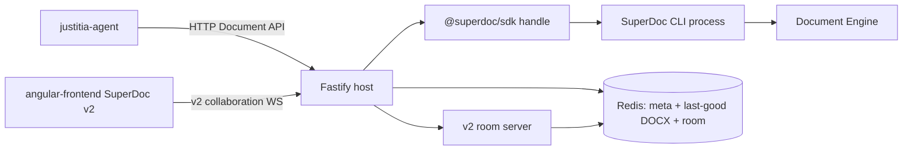

# Architecture Spine — SuperDoc Document-Engine Host

## Design Paradigm

This service is a **document-engine command host**. SuperDoc's Document Engine is the only component that may change a DOCX. HTTP routes, session storage, and collaboration rooms are adapters around that engine.

The engine contract is fixed:

```text
open → inspect → query → target → mutate → inspect receipt → persist → close
```

A model or agent may choose an operation. The host must not invent a second editor, a second coordinate system, or a second write path.



## Inherited Invariants

None. Initiative altitude; no parent spine.

## Architecture Decisions

### AD-1 — Document API is the only mutation authority

- **Binds:** all
- **Prevents:** a second home-grown editor, sync, or mark-fabrication stack beside SuperDoc
- **Rule:** Every document change is a Document API operation on a bound handle. Routes and collaboration adapters may only call that API. They must not write ProseMirror transactions, Yjs fragments, or OOXML bytes by hand except to persist the engine's own export.

### AD-2 — Official SDK is the only Node integration surface

- **Binds:** hosts, documents
- **Prevents:** JSDOM `Editor` internals, `@superdoc/headless`, `@superdoc/document-api-v2-adapter`, and custom `trackInsert` / `trackDelete` construction
- **Rule:** Node code talks to `@superdoc/sdk` document handles. Do not import SuperDoc implementation packages. Do not keep `@harbour-enterprises/superdoc` as a write path after the cutover.

### AD-3 — Address content by query and public IDs, not ProseMirror offsets

- **Binds:** routes, agent-tools
- **Prevents:** `from` / `to` integer offsets becoming the long-term targeting model
- **Rule:** Locate work with `query.match`, `extract`, or block `NodeAddress` values (DOCX `paraId` when present). Keep `expectedRevision` with every target or plan ref. After any mutation, query again. Do not derive mutation locations from rendered HTML or copied PM positions.

### AD-4 — Multi-edit work is an atomic mutation plan

- **Binds:** routes, agent-tools
- **Prevents:** partially applied multi-step agent turns
- **Rule:** Two or more edits that must succeed or fail together use `mutations.preview` then `mutations.apply` with `atomic: true` and a unique step id. One independent edit may use the matching direct operation. Preview validity is not a lock; apply still carries `expectedRevision`.

### AD-5 — Consequential agent edits are tracked

- **Binds:** documents, agent-tools
- **Prevents:** silent direct rewrites of contract language
- **Rule:** Host default `changeMode` is `tracked`. Direct mode requires an explicit caller flag and is limited to mechanical work. Do not accept accept/reject of tracked changes from the agent by default.

### AD-6 — A session is a handle lifecycle, not an immortal editor

- **Binds:** documents, persistence
- **Prevents:** long-lived in-process editors as the durable store
- **Rule:** Open a handle, use it, persist last-good DOCX after a successful receipt, close on success and failure. A warm handle is a cache. Eviction, TTL, export, and crash recovery all reopen from last-good DOCX or from the live v2 room — never from a leftover JSDOM instance.

### AD-7 — The engine stays behind the SDK process boundary

- **Binds:** host runtime, memory
- **Prevents:** JSDOM SuperDoc living in the Fastify heap
- **Rule:** The API process owns HTTP, admission, Redis, and room hosting. Document CPU and native memory run in the SDK-managed CLI process. Admission control still rejects work when host or worker RSS cannot take another open; it does not keep a JSDOM editor alive to avoid that cost.

### AD-8 — Isolated DOCX and shared room are the only two access modes

- **Binds:** documents, collaboration
- **Prevents:** custom ProseMirror-to-Yjs dual-write
- **Rule:** Agent-only work opens the persisted last-good DOCX. Human-visible work opens the same SuperDoc v2 collaboration room the browser joins (`client.open({ collaboration, doc })`). Never maintain a REST document and a collaboration document that are synced by a host-owned converter.

### AD-9 — Collaboration rooms are SuperDoc v2 only

- **Binds:** collaboration, sidebar-viewer
- **Prevents:** mixing v1 `@superdoc-dev/superdoc-yjs-collaboration` rooms with a v2 editor
- **Rule:** New rooms use SuperDoc v2 collaboration (Hocuspocus or y-websocket). Creating an existing room or joining a missing room is an explicit failure. Shared-room mode cannot ship until the sidebar editor is on SuperDoc v2.

### AD-10 — Last-good DOCX is the durable artifact

- **Binds:** persistence, export
- **Prevents:** Redis YDoc snapshots being the only recoverability story
- **Rule:** After a successful mutation batch, persist last-good DOCX plus session meta. Export writes a distinct output artifact. Closing a handle uses discard against the working copy when the distinct output already exists. Room state may be persisted for presence, but a cold restart must be able to seed from last-good DOCX.

### AD-11 — This service remains the agent HTTP boundary

- **Binds:** routes, agent-tools
- **Prevents:** justitia-agent growing a second, unhosted SuperDoc write path that bypasses session, identity, and analytics contracts
- **Rule:** justitia-agent keeps calling this host. New routes expose Document API shapes (query, extract, mutate, plan, comments, track-changes, export). Old position-based routes are a compatibility facade only.

### AD-12 — Every mutation has an explicit author

- **Binds:** documents, comments, tracked changes
- **Prevents:** generic `CLI` authorship shared by every unattributed automation
- **Rule:** `client.open` always receives the session user. Missing user identity is a 400. Do not fall back to SuperDoc's default CLI author.

### AD-13 — Receipts are the success contract; stale state retries once

- **Binds:** all mutations
- **Prevents:** treating a thrown-less call as success, and retry storms on live documents
- **Rule:** Inspect `receipt.success` (or plan step results) before persist or export. On `REVISION_MISMATCH`, `STALE_REVISION`, `ADDRESS_STALE`, or `TARGET_NOT_FOUND`, re-query and retry once. Never drop `expectedRevision` to make a retry pass. `NO_OP` and capability failures do not retry unchanged.

### AD-14 — Telemetry never carries document text

- **Binds:** analytics, logs
- **Prevents:** contract clauses and PII landing in logs or traces
- **Rule:** Log operation name, session id, failure code, receipt status, and timing. Do not log document text, full mutation payloads, or complete receipts. Existing Amplitude upload analytics and OTEL stay; they follow the same redaction rule.

### AD-15 — One public Cloud Run port

- **Binds:** server, collaboration
- **Prevents:** a second listen port or host-process cleanup at boot
- **Rule:** Fastify remains the public listener on `PORT`. Collaboration websocket shares that port. Do not reintroduce startup process killing.

### AD-16 — Compatibility is temporary; the v1 write stack is deleted

- **Binds:** migration, editor, routes
- **Prevents:** a permanent dual stack of JSDOM helpers plus Document API
- **Rule:** Keep a facade only while justitia-agent still emits old payloads. Do not reimplement `from` / `to` as the long-term model. Remove `editor/replace.ts`, `editor/insert.ts`, JSDOM `createHeadlessEditor`, and v1 collaboration once Document API routes and the chosen access mode are the only writers.

### AD-17 — HTTP status meanings stay frozen

- **Binds:** routes, agent-tools
- **Prevents:** justitia-agent treating a bad target as session expiry
- **Rule:** Unknown or expired session is 404. Validation, missing target, ambiguous match, and context-guard failures are 400. Capacity and memory admission are 503 with `Retry-After`.

## Consistency Conventions

- Document API names, inputs, targets, receipts, and failure codes are copied from SuperDoc, not renamed.
- Public block identity is `NodeAddress` / `nodeId`; for imported DOCX paragraphs that means native `paraId` when SuperDoc exposes it. Session-scoped `sdBlockId` is not a cross-open key.
- Mutation-ready refs are valid only for the `evaluatedRevision` that produced them.
- Isolated vs shared is an explicit session mode, set at upload or first human join, not inferred per request.
- Room create and room join are separate operations.
- Agent accept/reject of tracked changes is off unless a later decision turns it on.
- Compatibility routes may translate old payloads into Document API calls; they must not reopen the JSDOM editor.

## Stack

| Name | Version |
| --- | --- |
| Node.js | 20 |
| Fastify | 5.8.5 |
| @superdoc/sdk | 2.8.0 |
| @superdoc/cli | 0.31.0 |
| superdoc (browser v2, consumer) | 2.11.0 |
| @hocuspocus/server | 4.6.0 |
| ioredis | 5.8.2 |
| yjs (room persistence only) | 13.6.18 |
| Chainguard node-fips | 20 |

`@harbour-enterprises/superdoc` 1.46.x and `@superdoc-dev/superdoc-yjs-collaboration` 1.0.x are retiring write-path dependencies, not the target stack.

## Structural Seed

```text
/
  server.ts app.ts instrumentation.ts   # existing boot; one PORT
  hosts/                                # SuperDoc SDK client + CLI process lifecycle
  documents/                            # session registry, isolated vs shared mode, handle cache
  collaboration/                        # v2 room server adapter on the same Fastify port
  routes/
    document-api/                       # query, extract, mutate, plan, comments, review, export
    compat/                             # temporary justitia-agent position/paragraph facade
  persistence/                          # Redis: meta, last-good DOCX, optional room state
  services/analytics/                   # existing Amplitude + redacted logs
```

Seed only. Once code exists, the tree in the repo is the authority.

## Deferred

- Liveblocks as a room provider.
- SuperDoc MCP or `createAgentToolkit` inside this host.
- justitia-agent calling Python `superdoc-sdk` and bypassing this host.
- Content-control / template-first editing as the default agent style.
- Productized version history.
- Agent-driven accept/reject of tracked changes.

## Open Questions

- Measured CLI RSS for representative contracts, and how many concurrent warm handles fit the current 8 GiB Cloud Run budget.
- angular-frontend SuperDoc v2 ship date, which gates shared-room mode.
- Whether the compatibility facade fails closed on legacy `from` / `to`, or attempts a one-revision projection source map.

## Operational Envelope

- **Deploy:** same Cloud Run service, one container, one `PORT`, Node 20, Chainguard `node-fips:20`.
- **Environments:** existing regional deployments; sidebar `superdocSocketUrls` must move to v2 rooms in the same rollout as shared mode.
- **Infra:** Redis remains the session store. Last-good DOCX bytes replace "YDoc as the only body". Room persistence may use Redis; it is not a second source of truth for isolated sessions.
- **Operations:** health stays on `GET /health`. Admission stays 503. Engine worker failures close the handle and leave last-good DOCX in place. No boot-time host-process cleanup.
